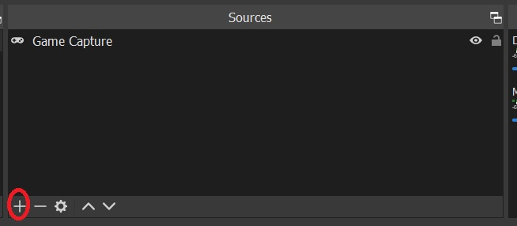

# FF XIV Simple Timer Overlay

[](/LICENSE)

<p align="center">
  
</p>

# Info

This is a overlay for [ACT OverlayPlugin](https://github.com/ngld/OverlayPlugin) that will display predefined timers without the need to create or configure any timer within [ACT](https://advancedcombattracker.com/).

**Note: In order to display buffs that affect your character or de-buff that you have inflict on a enemy you will need to trigger a zone change, either entering a map, instance, door, room, etc. that trigger an small loading. Of course this will happen as well when you login into the game. This only is when you first add this overlay to your ACT.**

# Usage (TL;DR)

## Add a new ACT Overlay:

ACT > Plugins > OverlayPlugin.dll > New > Preset = Custom > Type = MiniParser, with the URL :

https://juan-medina.github.io/ffxiv_act_simple_timer

## OBS or similar platforms

Start your Overlay Plugin WS:

ACT > Plugins > OverlayPlugin WSServer > Stream/Local Overlay > Start, and add a new web browser to OBS to:

https://juan-medina.github.io/ffxiv_act_simple_timer/?HOST_PORT=ws://localhost:10501/

Changing *localhost* and *1501* to what you set on the Overlay Plugin WS.

# Add a new ACT Overlay

## Prerequisites

First you should follow the [instructions to set-up and configure ACT, FFXIV Parser Plugin and Overlay Plugin](https://gist.github.com/TomRichter/e044a3dff5c50024cf514ffb20a201a9#installing-act--ffxiv-plugin).

## Add a new overlay

In ACT, click on *Plugins*, *OverlayPlugin.dll*, and then *New*.

<p align="center">
  
</p>

## Create new overlay

In the new window setup a *name*, choose *Custom* in *Preset* and *MiniParse* on *Type*.

<p align="center">
  
</p>

## Add URL

Select the overlay that you just create and set the *url* to :

https://juan-medina.github.io/ffxiv_act_simple_timer

<p align="center">
  
</p>

Now you could move and resize the overlay in your screen and lock when you don't need to move it or change it anymore.

# Using the overlay in OBS

## Starting the OverlayPlugin WS Server

In ACT, click on *Plugins*, *OverlayPlugin WSServer*, *Stream/Local Overlay* and then *Start*.

<p align="center">
  
</p>

Them *Status* will change to *Running*.

## Adding the Overlay to OBS

In OBS, go to your Sources and click on *+*

<p align="center">
  
</p>

Choose *Browser*

<p align="center">
  
</p>

Set the *URL* for the browser to:

https://juan-medina.github.io/ffxiv_act_simple_timer/?HOST_PORT=ws://localhost:10501/

<p align="center">
  
</p>

Now you could move the browser as you will usually do on OBS.

# Customize

## Download zip

On github you need to download a zip container this overlay, for this visit :

https://github.com/juan-medina/ffxiv_act_simple_timer

Then click on *Code*, and then on *Download Zip*

<p align="center">
  
</p>

Extract the zip and you will have something like this:

<p align="center">
  
</p>

## Change Overlay to use the folder

Now on ACT go to you overlay and click on the *...* where the URL is and browse to the *index.html* on the folder that you download

<p align="center">
  
</p>

## Edit the triggers

The triggers are located in the file [triggers.js](scr/triggers.js) in the scr folder. You could add and remove triggers here.

## Triggers Examples

Timer when your player get the Battle Voice buff.
```javascript
BuffOurPlayer(COLOR_DPS, 141);
```

Timer when a mob get the Trick Attack de-buff by any player.
```javascript
DebuffMobByAnyPlayer(COLOR_DPS, 2041);
```

Timer when your player get the Sentinel buff.
```javascript
BuffOurPlayer(COLOR_MITIGATION, 74);
```

Timer when your player get de-buff any mob with Reprisal.
```javascript
DebuffMobByOurPlayer(COLOR_MITIGATION, 753, 1193, 2101);
```

Each number is an Status id, we do not need to specify duration it will be obtained in the game log. Name the skill name it will be in the game local language. We neither need to provide the icon that is obtained by the overlay via [xivapi](https://xivapi.com).

For finding other Statuses ids you could use this url, changing the name of the status:

https://xivapi.com/search?indexes=status&string=Technical%20Finish

# Changing the UI

The css is located in the file [styles.css](css/styles.css) in the css folder, you could change the style there.

# Disclaimer

Use of this overlay is at your own risk. Square Enix does not permit the use of any third party tools, even those which do not modify the game. They have stated in interviews that they did not view parsers as a significant problem unless players use them to harass other players, so the consensus is to not discuss parsers or DPS in-game at all.